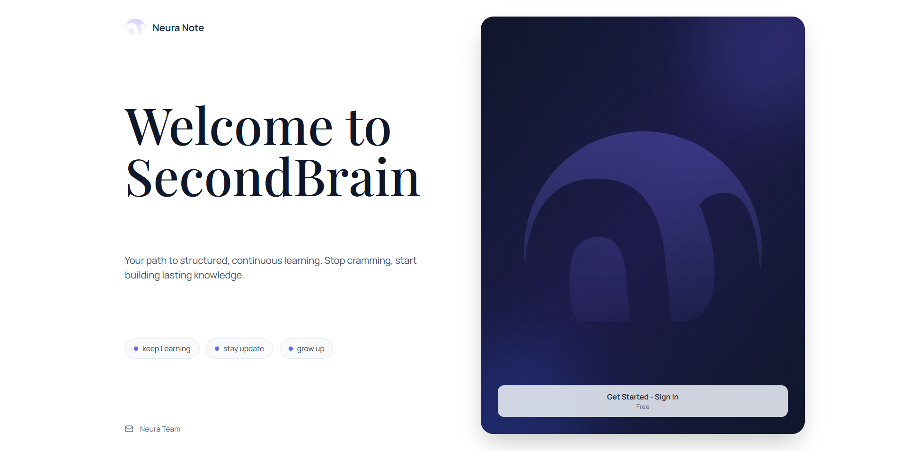
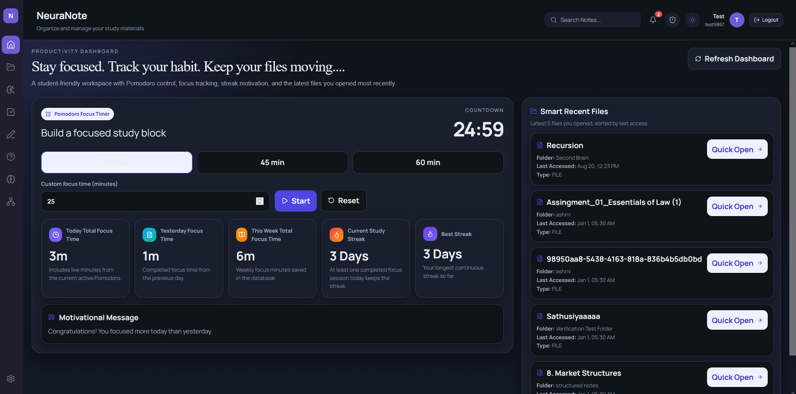
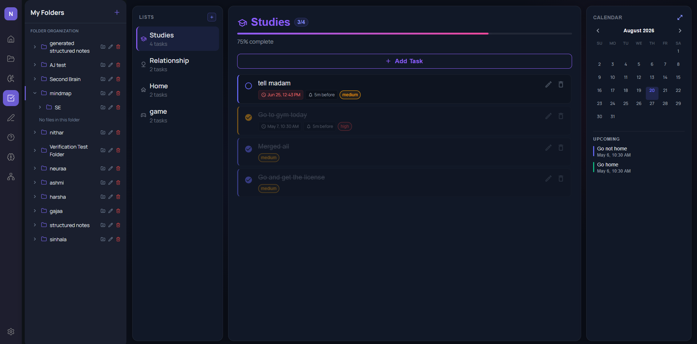
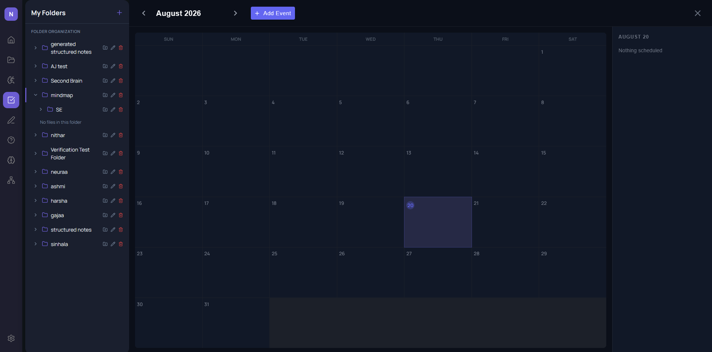
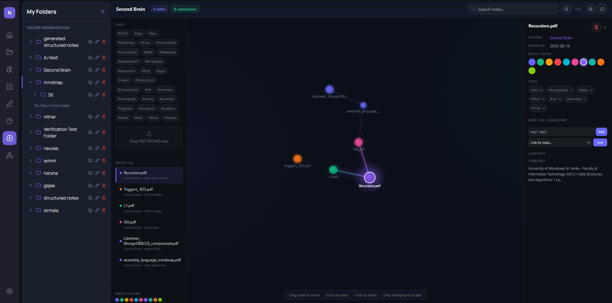
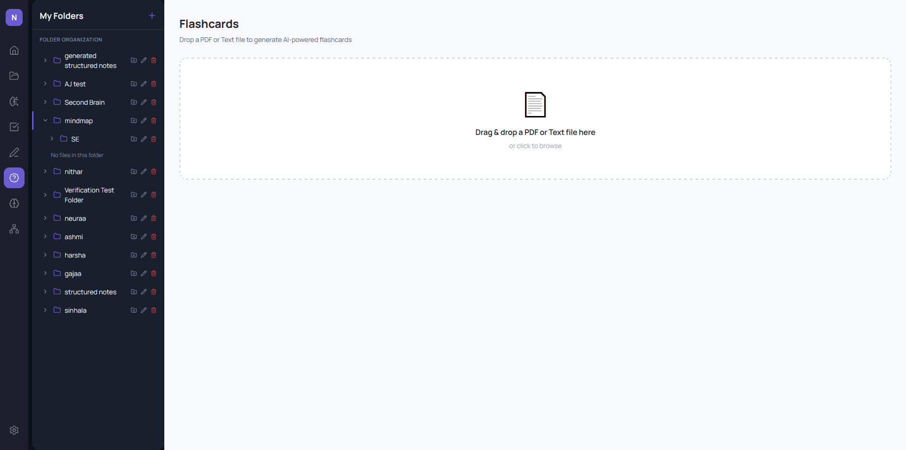
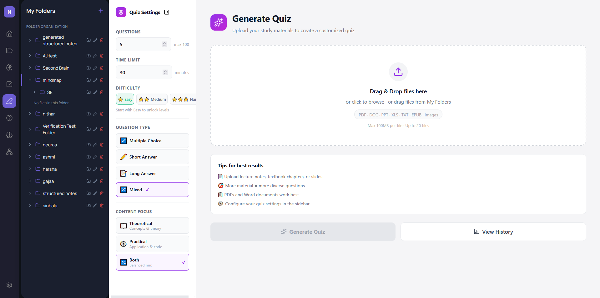
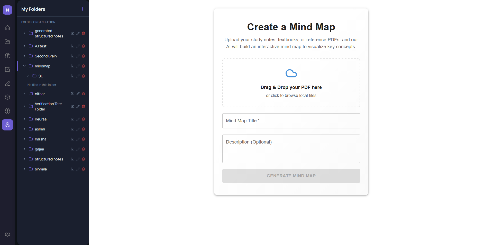

# NeuraNote

Smart study notes and productivity platform. Built by the SquadZero team for the Honours Degree in IT and Management at the University of Moratuwa.

NeuraNote is a full-stack web application that supports the whole study workflow in one place: capture material, understand it, test it, and stay organised while doing it. The platform combines smart note-taking, AI-assisted learning tools, file management, and personal productivity features (tasks, calendar, and a connected knowledge space) into one interface, powered by a FastAPI backend and a React frontend.

---

## What is NeuraNote?

Every stage of study is covered by a specific module.

- **Accounts and Admin** - secure sign up, login, email verification, password reset, OAuth, and an admin dashboard.
- **File Manager.** Dropbox style file management with a folder tree, previews, PDF handling, and AI summaries.
- **Smart Note Analyzer.** Turns uploaded material into structured, reusable study notes.
- **Quiz Generator.** AI generated quizzes with levels, scoring, history, and review.
- **Flashcards.** Flashcard decks for spaced repetition and memorisation.
- **Pomodoro Timer.** A focus timer for study sessions.
- **Tasks and Calendar.** A categorised task dashboard with due dates and an integrated calendar.
- **Second Brain.** A networked notes space using tags, backlinks and a link graph, so notes grow into a connected personal wiki.
- **Payments.** PayHere powered payments for premium and subscription features.

---

## Screenshots

The screenshots live in the `screenshots/` folder at the repo root.

| Login | Sign Up | Dashboard |
| :---: | :---: | :---: |
|  |  |  |

| Tasks | Calendar | Second Brain |
| :---: | :---: | :---: |
|  |  |  |

| Flashcards | Quiz | Mind Map |
| :---: | :---: | :---: |
|  |  |  |

All screenshots are contributed by the team and kept up to date as the interface changes. Add new captures to this folder and update the table when a feature changes visually.

---

## Tech Stack

### Frontend

| Layer | Technology |
| :--- | :--- |
| Language | React 19 (JSX) |
| Build tool | Vite 7 |
| UI framework | Material UI (MUI), Tailwind CSS |
| Styling | CSS Modules with a custom theme system (palette, typography, shadows) |
| Routing | React Router |
| HTTP client | Axios |
| Data visualisation | Recharts |
| Rendering | Mermaid, react-markdown, react-quill, html2canvas, jspdf |
| Motion | Framer Motion |
| Forms | React Hook Form, Zod |

### Backend

| Layer | Technology |
| :--- | :--- |
| Framework | FastAPI (Python) |
| Server | Uvicorn |
| Database | PostgreSQL (Supabase, with pgvector for embeddings) |
| ORM | SQLAlchemy |
| Auth | PyJWT, bcrypt, python-jose, passlib, authlib |
| AI | OpenAI and OpenRouter models; sentence-transformers (all-MiniLM-L6-v2) for embeddings |
| File processing | PyMuPDF, pypdf, reportlab, python-docx, python-pptx |
| Payments | PayHere |
| Testing | pytest, pytest-asyncio |
| Utilities | httpx, pydantic, python-multipart, python-dotenv, anyio, tzdata |

---

## Architecture

NeuraNote is a client-server app. The React frontend talks to the FastAPI backend over HTTP; the backend connects to PostgreSQL through SQLAlchemy and the Supabase client.

```text
[ Browser:  React  +  Vite ]
        |
        |  HTTP (Axios)
        v
[ FastAPI  (Uvicorn) ]
   |  app/api/v1/endpoints  versioned REST routes
   |  routes/               feature routers
   |  m3_structurednotes/   note and mind map module
   |  second_brain/         tags, backlinks, link graph
   +  services/             business logic
        |
        |  SQLAlchemy / Supabase
        v
[ PostgreSQL  (Supabase, pgvector) ]
```

### Core workflow

1. A user signs in through the auth layer and gets a signed JWT.
2. The user uploads study material through the File Manager.
3. The file is extracted; an optional AI summary is generated.
4. The Smart Note Analyzer turns the content into structured notes.
5. The Quiz Generator can turn the same material into quizzes.
6. The user organises their work with Tasks and Calendar.
7. Useful notes can be pushed into the Second Brain, where tags and backlinks build a connected knowledge graph.
8. The Pomodoro timer keeps the session focused, and Payments unlock premium features.

Because each module is wired independently into the `v1` router, the members' features can be developed and tested on their own without breaking other routes.

---

## Project Structure

```text
Squad_Zero/
├── backend/                    FastAPI (Python)
│   ├── app/
│   │   ├── api/v1/endpoints/   versioned endpoints (auth, admin, tasks, calendar, payments)
│   │   ├── core/               config, security
│   │   ├── db/                 database clients
│   │   ├── schemas/             Pydantic schemas
│   │   └── services/           business logic
│   ├── m3_structurednotes/     smart note analyzer and mind map (Member 3)
│   ├── second_brain/           tags, backlinks and graph (Member 5)
│   ├── routes/                 feature routers (files, quiz, flashcards, chat)
│   └── requirements.txt        dependency manifest
├── frontend/                   React (Vite)
│   └── src/
│       ├── pages/              route level pages
│       ├── components/         feature components (auth, quiz, tasks, filemanager)
│       ├── modules/            pomodoro, second brain
│       ├── m3_structurednotes/ Member 3 frontend
│       ├── services/           API clients
│       ├── themes/             design system
│       └── hooks/  utils/  context/  config/
└── screenshots/                page captures shown in this README
```

---

## Team and responsibilities

The project is built by five members. Everyone contributed across the stack, and each person owns one core module end to end.

### Member 1. Authentication and Admin Dashboard, Nihaaj Ahamed

Responsible for account security and the admin side of the app.

- **Backend.** `backend/app/api/v1/endpoints/auth.py`, `admin.py`, `user.py`, plus `auth_service.py` and the security and config modules under `app/core/`.
- **Frontend.** `pages/SignInPage.jsx`, `SignUpPage.jsx`, `ForgotPassword.jsx`, `ResetPassword.jsx`, `VerificationPage.jsx`, `AccountVerification.jsx`, `AccountSuspendedPage.jsx`, `OAuthCallback.jsx`, `AdminDashboard.jsx`, and `components/auth/*`.
- **Tech.** FastAPI, PyJWT, bcrypt, python-jose, passlib, authlib, Supabase auth, React MUI.
- **Features.** JWT session handling, role based access, email verification, password reset, account suspension, admin user management, and OAuth in the callback.
- **Deployment.** Owned the frontend hosting setup, adding Vercel URL rewrites and an environment driven API base URL so the build can point at a deployed backend.

### Member 2. File Manager, dashboard, Pomodoro and Flashcards, by Ashmitha Udayachandran

Responsible for the central file and preview layer plus the focus and flashcard tools.

- **File Manager backend.** `backend/routes/files.py`, `pdf.py`, `workspace.py`, plus `pdf_reader.py`, `export_service.py`, and `workspace_service.py` under `services/`.
- **File Manager frontend.** `components/filemanager/*` (FileList, FileViewer, FolderPanel, TopBar, SummaryPanel, Rail, SettingsPanel) and `pages/FileManagerPage.jsx`.
- **Dashboard.** The refreshed `pages/Dashboard.jsx` with folder organisation and AWS connected uploads.
- **Pomodoro.** `pages/PomodoroPage.jsx`, `utils/pomodoroTimer.js`, and `components/modules/pomodoro/*`.
- **Flashcards.** `backend/routes/flashcards.py` and `pages/FlashcardsPage.jsx`.
- **Payments.** `services/payhere_service.py`, `pages/PaymentResultPage.jsx`, and `app/api/v1/endpoints/payments.py`.
- **Tech.** PyMuPDF, pypdf, reportlab, python-docx, OpenAI summaries, React MUI.

### Member 3. AI Smart Note Analyzer and Mind Map, by Sandavi Nuthara

Responsible for turning raw study material into structured notes and visual maps.

- **Backend.** `backend/m3_structurednotes/` with `router.py`, `services.py`, `openai_client.py`, `database.py`, `models.py`, and the compiler for structured output.
- **Frontend.** `frontend/src/m3_structurednotes/` with `pages/Dashboard.jsx`, `NoteEditor.jsx`, `ManualNoteEditor.jsx`, plus `components/*` and `api.js`.
- **Tech.** FastAPI, OpenAI and OpenRouter clients, sentence-transformers embeddings, SQLAlchemy, React MUI.
- **Features.** Structured notes generation from uploaded files, an editor with images, saving notes to workspace folders on a standardized name, support to generate and drag workspace files straight into the note and mind map generators, and vision based image extraction for PDF pages.
- **Mind Map.** `pages/MindMapPage.jsx` and `components/mindmap/*`, with a purple theme shared with the note analyzer.

### Member 4. AI Quiz Generator, by Naviru Dissa

Responsible for the quiz module, from question generation to results.

- **Backend.** `backend/routes/quiz_routes.py`, `backend/services/openai_service.py`, and the `Requirements-m4.txt` dependency list.
- **Frontend.** `components/quiz/*` with `QuizHomePage.jsx`, `QuizPage.jsx`, `QuizTaking.jsx`, `QuizResults.jsx`, `QuizHistory.jsx`, `ConfirmDialog`, and `Toast`, plus their styles.
- **Tech.** FastAPI, OpenAI compatible clients, React MUI, document extraction (PDF, DOCX, slides, spreadsheets, images, EPUB, RTF).
- **Features.** AI generated quiz questions with adjustable levels and limits, retaking quizzes, long answers, scoring, history tracking, file uploads from the workspace folder tree, and rate limiting with slowapi.

### Member 5. Tasks, Calendar and Second Brain, by Anoj

Responsible for the productivity and knowledge layers, across both the API and the app.

- **Tasks.** `backend/app/api/v1/endpoints/tasks.py` and `components/tasks/*` in the frontend.
- **Calendar.** `backend/routes/calendar.py` and `components/calendar/*` with mini and expanded views.
- **Second Brain backend.** `backend/second_brain/` with `db.py`, `models.py`, `router.py`, `services.py`, `extract.py`, and a `self_test.py`.
  - Lets a user create a note from a dropped file and auto-generate tags and backlinks.
  - Provides the notes, tags and graph endpoints that show one connected knowledge space.
  - Supports `[[Note Title]]` wikilinks and auto tags for frequent terms.
- **Second Brain frontend.** `pages/SecondBrainPage.jsx`, `services/secondBrainApi.js`, and `components/modules/secondbrain/`.
- **Tech.** FastAPI, SQLAlchemy, Supabase/Postgres with pgvector, React MUI.
- **Features.** Kanban style task lists with colour coded projects and due dates, an inline mini and expanded calendar with category highlighting, due date notifications, and a fully theme aware interface with dark mode support.

---

## Getting Started

### Backend

```bash
cd backend
python -m venv venv                create a virtual environment
venv\Scripts\activate               activate on Windows
# or source venv/bin/activate      activate on macOS / Linux
pip install -r requirements.txt    install dependencies
cp .env.example .env               set DATABASE_URL and secrets
uvicorn main:app --reload
```

If you work on the AI bits only, install `requirements-ai.txt`:

```bash
pip install -r requirements-ai.txt
```

The API is served at `http://localhost:8000` with interactive docs at `/docs`.

### Frontend

```bash
cd frontend
npm install
cp .env.example .env    set VITE_API_BASE_URL
npm run dev             starts Vite at http://localhost:5173
```

The frontend proxies API calls to `http://localhost:8000` (see `vite.config.js`), and can be built for production with `npm run build`.

---

## Environment variables

Both `.env.example` files (one in `backend/`, one in `frontend/`) list every variable the app reads. Never commit a real `.env`; copy the template and fill in keys that belong to the project secrets.

---

Built by the SquadZero team. For questions or contributions, open an issue or reach the maintainers.